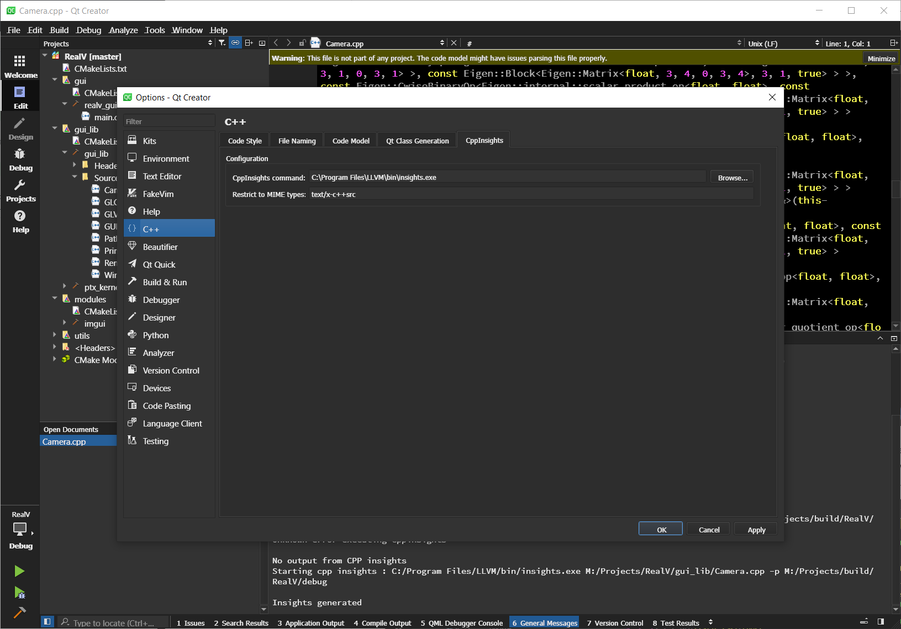
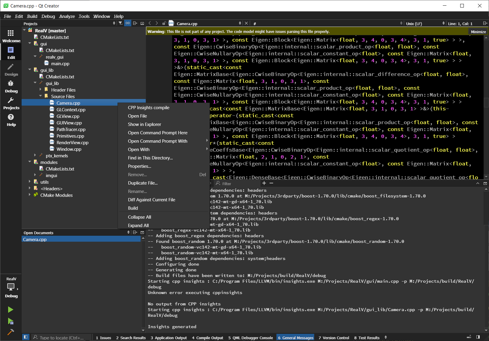

# CPP Insights plugin for Qt Creator

This plugin aims simplifying usage of [CppInsights](https://github.com/andreasfertig/cppinsights) inside the QtCreator. The LLVM backend of CppInsights supports compile commands [json file](https://clang.llvm.org/docs/JSONCompilationDatabase.html) via -p "folder" argument and this plugin utilizes this mechanism to generate cpp files. 

CMake can generate the compile commands file by enabling [CMAKE_EXPORT_COMPILE_COMMANDS](https://cmake.org/cmake/help/latest/variable/CMAKE_EXPORT_COMPILE_COMMANDS.html). **compile_commands.json** is then generated at the build folder.

When CppInsights plugin is enabled in QtCreator, a tab named CppInsights appear in the Options/C++. In this tab, the name of the [insights executable](https://github.com/andreasfertig/cppinsights/releases) and mime types are expected. 

If configuration is provided, in the project explorer right clicking on the cpp files, the context menu provides "Cpp Insights compile" menu item. When clicked, it compiles the selected file and outputs the generated cpp file in a new text editor.

## Compiling

You will have to install the same Qt version (ie: 5.14 MSVC 2017 64 bit for 4.11.0) that was used to build the Qt creator version you are targeting for the plugin.  
You can check this in the "about" menu of Qt creator.  

* Download and extract the Qt creator sources from the official website  
* Compile them using the correct Qt kit (Optional on linux, you can point to the official binary release which should be in your home folder by default)  
* You don't need to install it when compiled  
  
  ##### To compile the plugin you have 2 options:  
#### Qmake  
* Specify the path of source and binaries for Qt creator using **QTC_SOURCE** and **QTC_BUILD** vars  
* **QTC_SOURCE** must point to the sources you extracted  
* **QTC_BUILD** must point to your build folder (or binary release on Linux)  
* Example command: *qmake QTC_SOURCE=\~/src/qt-creator-opensource-src-4.11.0 QTC_BUILD=\~/qtcreator-4.11.0* .  
  
#### Qt Creator  
* Specify the path of source and binaries for Qt creator by editing the CppInsightsPlugin.pro file  
* You have to change the **QTCREATOR_SOURCES** and **IDE_BUILD_TREE** vars  

## Installing  
If you compiled the plugin, it will be installed automatically.  
  
##### If you downloaded a binary release, the paths are as follow:  
* Unix: ~/.local/share/data/QtProject/qtcreator/plugins/**\<version\>**  
* OSX: ~/Library/Application Support/QtProject/Qt Creator/plugins/**\<version\>**  
* Windows: %LOCALAPPDATA%\QtProject\qtcreator\plugins\\**\<version\>**  
Replace **\<version\>**  with your Qt Creator version (ie: 4.11.0)